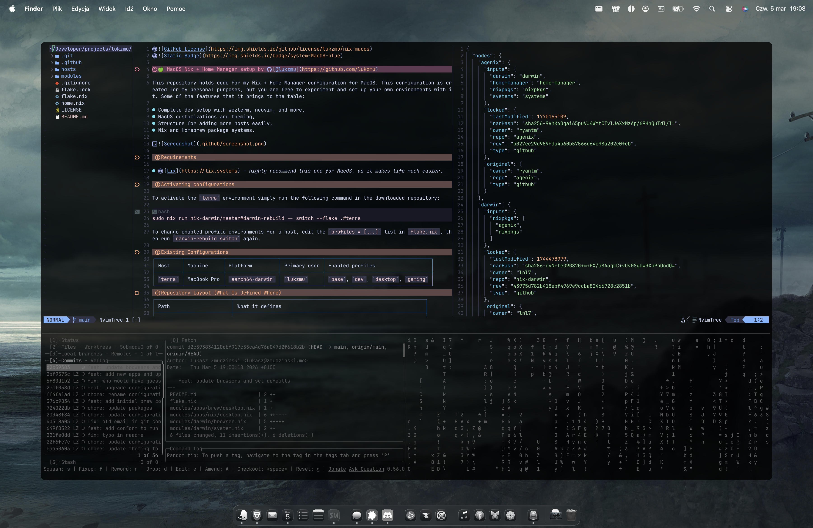

# 🍏 Nix + Home Manager setup by [@lukzmu](https://github.com/lukzmu)

This repository holds code for my Nix + Home Manager configuration across macOS
(nix-darwin) and NixOS. This configuration is created for my personal purposes, but you
are free to experiment and set up your own environments with it. Some of the features that
it brings to the table:

- Complete dev setup with ghostty, neovim, and more,
- MacOS customizations and theming,
- NixOS desktop built on the Niri scrollable-tiling Wayland compositor with
  [DankMaterialShell](https://danklinux.com), and NVIDIA support,
- Structure for adding more hosts easily,
- Nix and Homebrew package systems.



## Requirements

- [Lix](https://lix.systems) - *highly recommend this one for MacOS, as it makes life much easier*.

## Activating configurations

To activate a host environment, run the following in the downloaded repository, replacing
`<host>` with the host name. On macOS:

```bash
sudo nix run nix-darwin/master#darwin-rebuild -- switch --flake .#<host>
```

On NixOS:

```bash
sudo nixos-rebuild switch --flake .#sol
```

For kernel or NVIDIA driver changes use `boot` instead of `switch` and reboot. A live
`switch` cannot swap a loaded kernel module, which leaves userspace libGL and the kernel
module on different versions and produces a black or hung session.

To change enabled profile environments for a host, edit the `profiles = [...]` list in
`flake.nix`, then rebuild.

When you add new files to this flake, make sure they are tracked by Git before running
`nix` commands. Git-based flakes only see tracked files.

### Where the repository must live

`flake.nix` threads a `flakeRoot` path into Home Manager, defaulting to
`~/developer/projects/lukzmu/nix-config`. `~/.config/nvim` is symlinked to the working tree
at that path instead of into the Nix store, so `:Lazy sync` can write `lazy-lock.json`
straight back into the repository and Lua edits apply without a rebuild.

**If your checkout is somewhere else, set `flakeRoot` for that host in `flake.nix`** —
otherwise `~/.config/nvim` will be a dangling symlink and neovim starts unconfigured.

## Development and everyday usage

To ease development you can use `mise` commands.

| Command | Description |
| --- | --- |
| `mise lint` | Lint nix configurations |
| `mise fix` | Fix improper nix configurations |
| `mise run switch <host>` | Build and switch to the selected host configuration |
| `mise run boot sol` | Stage a NixOS configuration for the next boot |
| `mise run check` | Evaluate every host configuration without building |
| `mise run build` | Build the `sol` system closure without activating it |
| `mise purge` | Cleanup old builds |
| `mise prek-install` | Install prek hooks |
| `mise prek-run` | Use prek hooks manually |

Examples: `mise run switch terra` or `mise run switch sol`.

## Existing Configurations

| Host | Machine | Platform | Primary user | Enabled profiles |
| --- | --- | --- | --- | --- |
| `terra` | MacBook Pro | `aarch64-darwin` | `lukzmu`                       | `base`, `ai`, `dev`, `personal`, `gaming` |
| `luna`  | MacBook Air | `aarch64-darwin` | `lukasz.zmudzinski@stxnext.pl` | `base`, `dev`, `work` |
| `sol`   | Desktop PC  | `x86_64-linux`   | `lukzmu`                       | `base`, `ai`, `dev`, `personal`, `gaming`, `desktop` |

## Repository Layout (What Is Defined Where)

| Path | What it defines |
| --- | --- |
| `flake.nix` | Main flake entrypoint: inputs, hosts, enabled profiles, and `flakeRoot`. |
| `home.nix` | Home Manager entrypoint for user-level configuration. |
| `hosts/` | Host-specific settings, identities, disk layout, and overrides. |
| `modules/darwin/` | Shared nix-darwin baseline settings. |
| `modules/nixos/` | Shared NixOS baseline: system, NVIDIA, and the Niri desktop. |
| `modules/apps/` | Package/application definitions by platform and profile. |
| `modules/home/profiles/` | Profile definitions used by Home Manager (`base`, `dev`, etc.). |
| `modules/home/programs/` | Program-specific user configs (shell, git, editor, terminal). |
| `modules/home/programs/desktop/` | Niri compositor configuration (`config.kdl`). |

## The desktop: Niri + DankMaterialShell

`sol` runs [Niri](https://github.com/YaLTeR/niri) with
[DankMaterialShell](https://danklinux.com) on top. DMS is a complete Quickshell desktop
shell and, in upstream's words, "replaces waybar, swaylock, swayidle, mako, fuzzel,
polkit" — so none of those are configured here. It provides the bar, application
launcher, notifications, lock screen and idle handling, wallpaper, clipboard UI, control
centre and polkit agent.

This uses the **nixpkgs module** (`programs.dms-shell`), not the DankMaterialShell flake.
That choice mirrors using nixpkgs' `programs.niri` over `niri-flake`, and it avoids three
things: an extra flake input, building Quickshell from source with no binary cache, and
the flake's niri module — which overwrites `~/.config/niri/config.kdl` and requires
niri-flake.

DMS starts from its own systemd user unit off `graphical-session.target`, so `config.kdl`
deliberately does **not** `spawn-at-startup "dms" "run"`; doing both starts two copies.
`cliphist` is still enabled because DMS's clipboard UI reads from it.

Shell keybinds (all `dms ipc call`, see `modules/home/programs/desktop/niri/config.kdl`):

| Bind | Action |
| --- | --- |
| `Mod+Space` | Application launcher (spotlight) |
| `Mod+Shift+V` | Clipboard history |
| `Mod+N` | Notification centre |
| `Mod+Shift+C` | Control centre |
| `Mod+M` | Process list |
| `Mod+Shift+Comma` | Shell settings |
| `Mod+Y` | Browse wallpapers |
| `Mod+X` | Power menu |
| `Mod+Alt+L` | Lock screen |

Volume, mic and brightness keys are routed through DMS so its on-screen display appears.

If you see flicker or stutter on NVIDIA, add a `debug` block to `config.kdl` with either
`wait-for-frame-completion-before-queueing` or `disable-direct-scanout` — one, not both.

Login is still `greetd` + `tuigreet`. If you would rather have a graphical greeter that
matches the shell, nixpkgs also ships `services.displayManager.dms-greeter`, which can run
the greeter inside niri — swap it for the `services.greetd` block in
`modules/nixos/desktop.nix`.

## Installing `sol` on bare metal

`sol` uses [disko](https://github.com/nix-community/disko) for declarative partitioning
with LUKS full-disk encryption. Boot the NixOS minimal ISO in **UEFI mode with Secure Boot
disabled**, then:

```bash
# 1. CONFIRM the target disk, then fix `disk` at the top of hosts/sol/disko.nix.
lsblk

# 2. Partition, encrypt and mount. THIS WIPES THE DISK.
#    Prompts for the LUKS passphrase you will type at every boot.
sudo nix --experimental-features "nix-command flakes" run \
  github:nix-community/disko -- --mode destroy,format,mount --flake .#sol

# 3. Regenerate the hardware config. --no-filesystems is essential:
#    disko owns every fileSystems entry and a generated one would collide.
sudo nixos-generate-config --no-filesystems --root /mnt
# Diff it against hosts/sol/hardware-configuration.nix, merge any extra
# boot.initrd.availableKernelModules entries, then `git add` the result.

# 4. Install. Prompts for the root password.
sudo nixos-install --flake .#sol

reboot
```

After the first boot:

1. Run `passwd` immediately — the user account ships with the bootstrap password
   `changeme`, which is world-readable in the Nix store.
2. Move the repository to `~/developer/projects/lukzmu/nix-config` (or whatever you set
   `flakeRoot` to), otherwise `~/.config/nvim` dangles and neovim starts unconfigured.
3. Fill in the real monitor setup: run `niri msg outputs`, uncomment and correct the
   `output` block in `modules/home/programs/desktop/niri/config.kdl`, then rebuild.

If the graphical session does not come up, switch to a TTY with `Ctrl+Alt+F2` and check
`journalctl -b -u greetd` and `journalctl -b --user -u niri`.
`sudo nixos-rebuild switch --rollback` gets you back.

## macOS packages with no Linux equivalent

`sol` installs the direct Linux equivalent of every macOS package that has one. These do
not, and nothing was installed in their place:

| macOS package | Why | If you want it later |
| --- | --- | --- |
| `m-cli` | macOS system CLI | its jobs are NixOS options here |
| `mas` | Mac App Store client | not applicable |
| `rectangle` | macOS window snapping | Niri replaces this by design |
| `diskonaut` | not packaged in nixpkgs | `ncdu`, `dua`, `gdu` |
| `parqeye` | not packaged in nixpkgs | `duckdb` reads parquet |
| `battle-net` | no native Linux client | `lutris` or `bottles` + Proton |
| `curseforge` | AppImage only, not packaged | `prismlauncher` for Minecraft |
| Numbers, Pages | macOS-only | `libreoffice-fresh`, `onlyoffice-desktopeditors` |
| Amphetamine | macOS-only | `systemd-inhibit`; Niri has idle inhibit built in |
| Brother iPrint&Scan | macOS-only | CUPS is already enabled; add `brlaser` / `sane-airscan` |
| uBlock Origin Lite | browser extension | install from the browser |
| `google-gemini` | no Linux desktop app | use the web app |
| `microsoft-teams` | native client discontinued | `teams-for-linux` |

Steam is enabled on `sol` even though it is not part of the macOS config, since Proton is
how most of the above would actually run on Linux. It is switched on with
`programs.steam.enable` in `modules/apps/x86_64-linux/gaming.nix`.

Note that Steam is unfree, so Hydra does not build it and it is never in
`cache.nixos.org` — the first build compiles `steam-unwrapped` locally. This needs the Nix
sandbox enabled (the NixOS default): Steam's Makefile writes apt sources whenever it can
see an `/etc/apt`, which never exists inside a sandbox or on NixOS.

A few extras are one line away if you want them:

| Option | What it adds |
| --- | --- |
| `programs.steam.extraCompatPackages = [pkgs.proton-ge-bin];` | Proton-GE, usually better compatibility than stock Proton |
| `programs.steam.gamescopeSession.enable = true;` | A Big Picture session you can pick at the login screen |
| `programs.gamemode.enable = true;` | CPU governor and scheduling tweaks while a game runs |
| `programs.steam.remotePlay.openFirewall = true;` | Opens ports 27031-27036 for Steam Remote Play |
| `programs.steam.localNetworkGameTransfers.openFirewall = true;` | Opens ports for LAN game transfers |

## Known issues

- `battle-net` homebrew cask is installed, but only as a standalone setup app. You need to run it to actually install the app. After everything works just fine.
- On macOS the ghostty config is written to `config.ghostty`, but ghostty reads `config`
  in that directory. The macOS config is likely inert; fixing it will change how terra's
  terminal looks, so it is left alone here.
